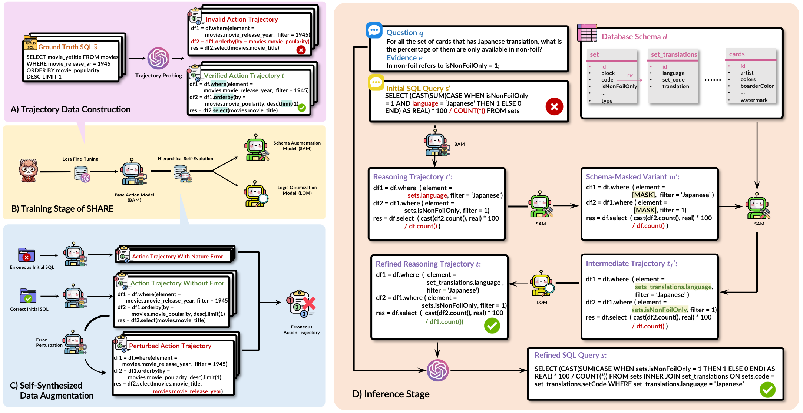

# SHARE: An SLM-based Hierarchical Action CorREction Assistant for Text-to-SQL

[](https://bird-bench.github.io/)
[](https://yale-lily.github.io/spider)
[](https://www.python.org/downloads/release/python-31018/)
[](https://pypi.org/project/vllm/0.9.1/)
[](https://pypi.org/project/openai/1.93.0/)

This is the official repository for the paper ["SHARE: An SLM-based Hierarchical Action CorREction Assistant for Text-to-SQL"](https://arxiv.org/abs/2506.00391), which has been accepted to ACL Main 2025.

## Overview




In this work, we propose an assistant-based framework where generator LLMs create initial outputs and implement self-correction guided by assistants. Our primary contribution, **SHARE** (**S**LM-based **H**ierarchical **A**ction Cor**RE**ction Assistant), orchestrates three specialized Small Language Models (SLMs), each under 8B parameters, in a sequential pipeline. Specifically, the Base Action Model (BAM) transforms raw SQL queries into action trajectories that capture reasoning paths; the Schema Augmentation Model (SAM) and the Logic Optimization Model (LOM) further perform orchestrated inference to rectify schema-related and logical errors, respectively, within action trajectories. SHARE improves error detection precision and correction efficacy while reducing computational overhead compared to conventional LLM approaches. Additionally, we also incorporate a novel hierarchical self-evolution strategy that enhances data efficiency during training.


## Environment Setup

• Use the following command to configure local environment:

   ```bash
    $ conda create -n share python=3.10
    $ conda activate share
    $ pip3 install -r requirements.txt
   ```

• Set environment variables for the Azure OpenAI API or modify your own OpenAI config in `./src/llm.py`:
   ```bash
   export OPENAI_API_BASE="YOUR_OPENAI_API_BASE"
   export OPENAI_API_KEY="YOUR_OPENAI_API_KEY"
   export ENGINE_ID="YOUR_ENGINE_ID"
   ```

• Set environment variable to specify which GPU devices are visible to your program:
   ```bash
   export OPENAI_API_BASE="YOUR_OPENAI_API_BASE"
   export OPENAI_API_KEY="YOUR_OPENAI_API_KEY"
   export ENGINE_ID="YOUR_ENGINE_ID"
   ```

## Data Preparation

The BIRD dev set used in the paper could be directly downloaded from the [BIRD Leaderboard](https://bird-bench.github.io/). Please put the unzipped folder under `./data/` after downloading sucessfully. The dataset under the `./data/dev_databases/` should contain the following resources:
 
- `database`: Each database folder should contain 
  - `database_description`: The csv files are manufactured to describe database schema and its values for models to explore or references.
  - `sqlite`: The database contents in BIRD.
- `dev_tables.json`: The file contains related information for each database, including `db_id`, `table_names_originial`, etc,. 
- `dev.json`: The file contains text-to-SQL paired with the oracle knowledge evidence. 